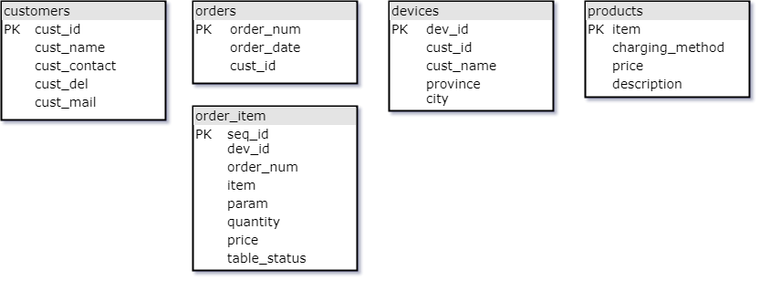
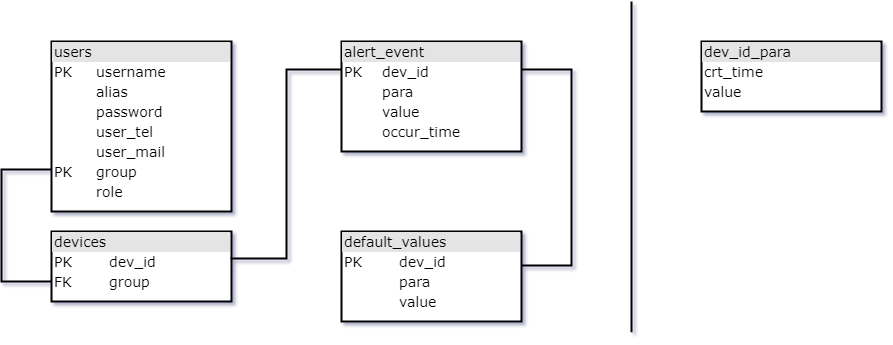

# Moech

A PHP server-side project providing monitoring services for IoT devices

## Stack

Considering the demand of monitoring IoT sensors or system data that come with a large quantity, nowadays there's a new kind of storage program called time series database(TSDB) optimized specially for handling and storaging data with a timestamp. But each of them requires special runtime environment configuration or high level hardware, for example,

* [InfluxDB](https://github.com/influxdata/influxdb) requires SSD and more RAMs;
* [TimescaleDB](https://github.com/timescale/timescaledb) is a package built as a PostgreSQL extension;
* [OpenTSDB](https://github.com/OpenTSDB/opentsdb) need Apache HBase, etc.

Since the present database configuration is MySQL, the original cache layer architecture plan, which deploys Redis, a NoSQL database runs in RAM in order to achieve fast querying, seems easy and economic. But if there's a chance to give TSDB a try, it's fairly feasible to switch to PostgreSQL Timescale because PHP has PDO driver as well.

## Overview

### MySQL databases

#### Vendor Database Tables



##### 1. customers

* This table records basic information of customers.

* Those who don't have orders can still sign up.

* The order number is an auth token that is visable to purchasers.

column | type | null | default | extras | comments
:--- | :--- | :--- | :--- | :--- | :---
cust_id | int(11) | no | none | auto_increment | primary key
cust_name | char(50) | no | none | |
cust_contact | char(50) | yes | null | |
cust_tel | char(15) | yes | null | |
cust_mail | char(50) | yes | null | |

##### 2. devices

column | type | null | default | extras | comments
:--- | :--- | :--- | :--- | :--- | :---
dev_id | char(20) | no | none | | primary key
cust_name | char(50) | no | none | | foreign key
order_num | int(15) | no | none | | foreign key

##### 3. orders

column | type | null | default | extras | comments
:--- | :--- | :--- | :--- | :--- | :---
order_num | int(15) | no | none | | primary key
order_date | datetime | no | none | |
cust_id | int(11) | no | none | | foreign key

##### 4. orderitems

* This table lists items in each order.

column | type | null | default | extras | comments
:--- | :--- | :--- | :--- | :--- | :---
ordernum | int(15) | no | none | | primary key
item | char(30) | no | none | | foreign key
price | float(6,2) | no | none | |

##### 5. products

* This table lists the price of each service.

* The total cost is accumulated according to the magnititude of those parameters requested by the customers.

column | type | null | default | extras | comments
:--- | :--- | :--- | :--- | :--- | :---
item | char(20) | no | none | | primary key
charging method | char(20) | no | none | |
price | float(6,2) | no | none | |

#### Customer database tables



##### 1. information

###### 1. users

* It's optional whether the new customer could provide the system manager registration info when a purchase  is made.

* They can send this message later with an unique code associated with the order number, or simply, just the order num.
  
column | type | null | default | extras | comments
:--- | :--- | :--- | :--- | :--- | :---
username | char(30) | no | none | for logging in | primary key
alias | char(30) | yes | null | |
password | varchar(60) | no | none | encrypted |
user_tel | char(15) | no | none | |
user_mail | char(50) | yes | null | |
group | char(40) | no | none | | primary key
role | char(20) | no | none | |

###### 2. devices

column | type | null | default | extras | comments
:--- | :--- | :--- | :--- | :--- | :---
dev_id | char(20) | no | none | | primary key
group | char(40) | no | none | | foreign key

###### 3. alert_event

column | type | null | default | extras | comments
:--- | :--- | :--- | :--- | :--- | :---
dev_id | char(20) | no | none | | primary key
para | char(20) | no | none | |
value | float(8,2) | no | none | |
occur_time | datetime | no | none | | primary key

###### 4. default_values

column | type | null | default | extras | comments
:--- | :--- | :--- | :--- | :--- | :---
dev_id | char(20) | no | none | | primary key
para | char(20) | no | none | |
val | float(6,2) | no | none | |

##### 2. values

###### value_item

* The name format of those tables is `dev_id_para`
* No primary keys set for those tables

column | type | null | default | extras | comments
:--- | :--- | :--- | :--- | :--- | :---
crt_time | datetime(3) | no | none | |
val | float(6,2) | no | none | |

## Getting Started

A little PHP and MySQL knowledge along with some NoSQL, for example, Redis.

### Prerequisites

* Environment
  * Apache
  * MariaDB (Main storage)
  * PHP
  * Redis (Cache)
  * Vue.js (for demonstration only)

### Installing

End with an example of getting some data out of the system or using it for a little demo

## Running the tests

* An ideal input for signing up should be like this:

```JSON
{
    "customer": {
        "name": "Pipimi",
        "mail": "anime@kuso.com",
        "tel": "114-514-893",
        "company": "Pop Team Epic"
    }
}
```

* An ideal input for devices' registration should be lile this:

```JSON
{
    "id_01": {
        "data": {
            "data_persistence": {
                "toggle": "on",
                "data_integrity": {
                    "raw": "yes",
                    "simplification": "no"
                }
            },
             "interval": "60",
             "Ecryption": "yes"
        },
        "owner": "Pipimi",
        "parameter_01": {
            "alarm": {
                "toggle": "on",
                "customization": "no",
                "type": "abnormal",
                "range": ""
            },
            "visualization": {
                "toggle": "on",
                "type": "line-chart"
            },
            "diagnosis": {
                "toggle": "off"
            }
        }
    }
}
```

### Break down into end to end tests

Explain what these tests test and why

### And coding style tests

Explain what these tests test and why

## Deployment

Add additional notes about how to deploy this on a live system

## Built With

* [predis](https://github.com/nrk/predis) - A flexible and feature-complete Redis client for PHP and HHVM
* [Workerman](https://github.com/walkor/Workerman) - An asynchronous event driven PHP framework for easily building fast, scalable network applications.
* [Vue.js](https://github.com/vuejs/vue) - A progressive, incrementally-adoptable JavaScript framework for building UI on the web.

## Contributing

## Versioning

## Authors

## License

## Acknowledgments

* Hat tip to anyone whose code was used
* Inspiration
* etc